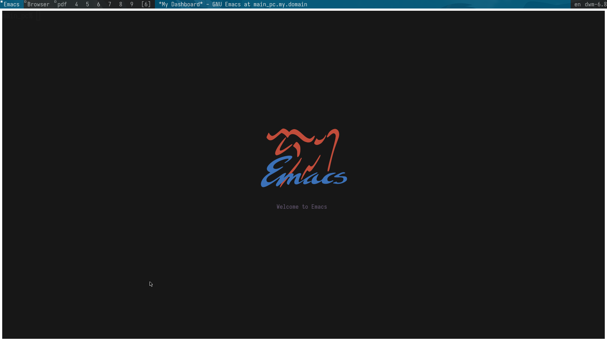

# My emacs configuration made with simplicity in mind.
 
## Packages:
### UI / Look & Feel
- **doom-themes** — theme support
- **gruber-darker-theme**, **gruber-darker-themezz**, **gruvbox-theme**, **spacemacs-theme** — additional theme options
- **smart-mode-line** — modeline styling
- **pulsar** — subtle UI pulse effects
- **nerd-icons** (+ **nerd-icons-corfu**) — icon support (tab line icons)
- **minimal-dashboard** — minimal dashboard UI
- **volatile-highlights** — highlight recent changes/yanks
- **display-time** (built-in) — show current time 

### Completion / Minibuffer UX
- **ivy** — completion UI in minibuffer
- **corfu** — completion UI 
- **mono-complete** — monospace completion support/assets
- **zig-mode** — Zig language support

### Editing Enhancements
- **visual-replace** — live visual replace 
- **surround** — surround editing (keybound)
- **yasnippet** — snippet expansion 

### Navigation / Editing Helpers
- **crux** — extra editing commands (keybound)
- **avy** — fast navigation to visible chars
- **goto-line-preview** — enhanced goto-line experience
- **multiple-cursors** — multi-cursor editing 

### Language / Programming
- **prism** — syntax highlighting enhancements
- **indent-guide** — indent guides
- **markdown-mode** — markdown editing
- **magit** — git integration
- **zig-mode** — Zig editing

### Terminal / Integrated Tools
- **vterm** — toggleable terminal

### Tabs / Tab Line
- **tab-line-nerd-icons** — tab line UI 

### Folding
- **yafolding** — code folding 

### Performance / Runtime
- **gcmh** — garbage collection tuning 
- **winner-mode** (built-in) — window history management

## Custom keybindings

### Window / navigation
- `M-o` → `other-window`
- `M-p` → previous logical line + recenter
- `M-n` → next logical line + recenter

### Completion / search / commands
- `C-s` → `swiper`
- `M-x` → `counsel-M-x`
- `C-x C-f` → `counsel-find-file`
- `M-i` → `counsel-imenu`

### Goto line / navigation
- `M-g M-g` → `goto-line-preview`
- `C-M-;` → `avy-goto-char`

### Completion / compile
- `C-M-c` → `compile`
- `C-a` → `back-to-indentation`

### Multiple cursors
- `C-S-c C-S-c` → `mc/edit-lines`

### Surround editing
- `C-q` → `surround-insert`
- `C-S-q` → `surround-change`

### Kill / buffer management
- `C-z C-k` → `kill-current-buffer`
- `C-z M-k` → `kill-buffer-and-window`

### Tabs
- `M-l` → `tab-line-switch-to-next-tab`
- `M-h` → `tab-line-switch-to-prev-tab`

### Crux (extra commands)
- `C-k` → `crux-smart-kill-line`
- `C-c s` → `crux-sudo-edit`
- `C-<return>` → `crux-smart-open-line`

### Dired behavior
- `dired` → `F` runs `my-dired-find-file` (opens marked/point file(s))
  - (also: `my-dired-find-file` uses `dired-get-marked-files` + `find-file`)

### Folding
- `C-r` → `yafolding-toggle-element`

### Terminal
- `<f1>` → `vterm-toggle`

### Minor notes (not keybindings, but keymap/config-related tweaks)
- `(put 'upcase-region 'disabled nil)` enables `upcase-region` behavior
- Relative line numbers in relative mode:
  - `prog-mode-hook` → `display-line-numbers-mode`
  - `setq display-line-numbers-type 'relative`
- Deletes selected text if started typing: `delete-selection-mode 1`
- Menu/tool bar + scroll bar disabled
- Compilation window auto-closes on success (via `compilation-exit-autoclose`)
- Disable server-client instructions: `(setq server-client-instructions nil)`
